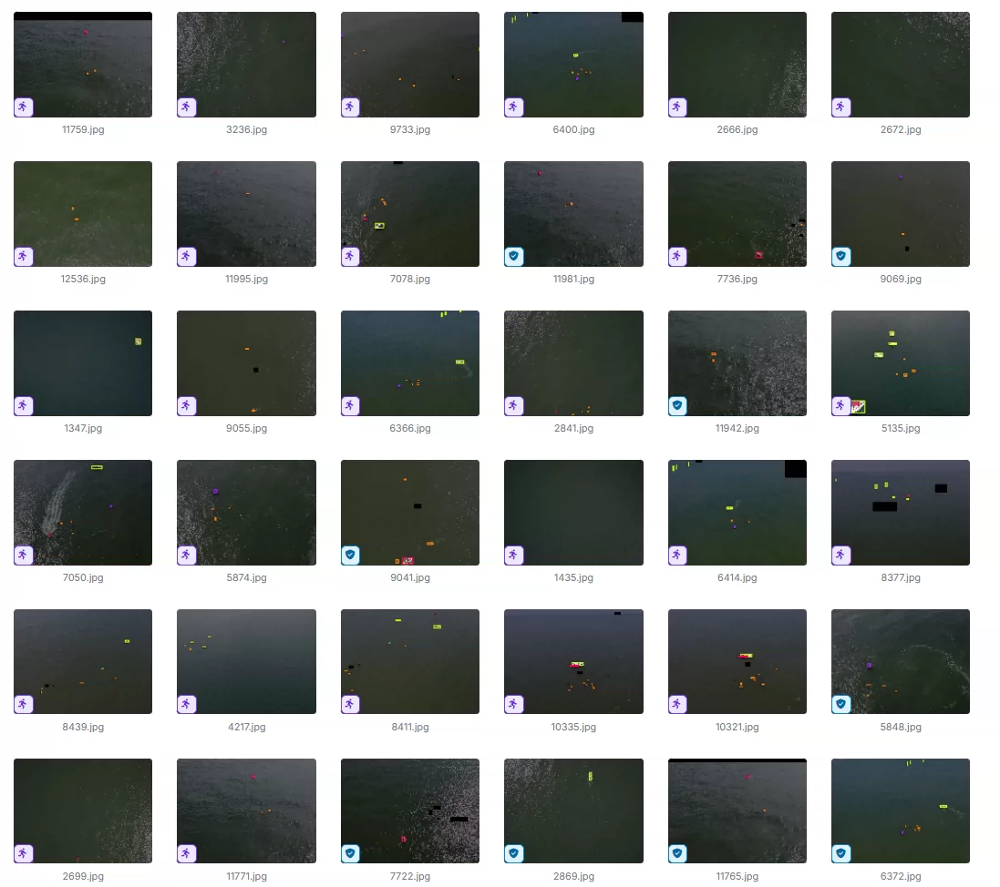
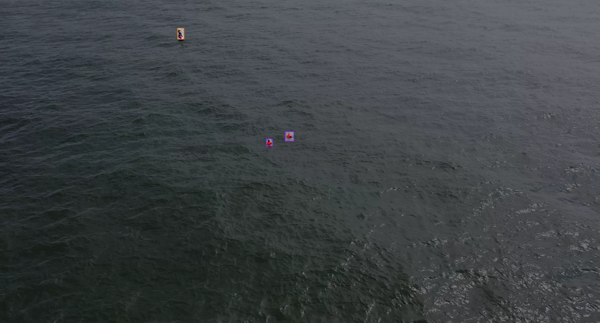
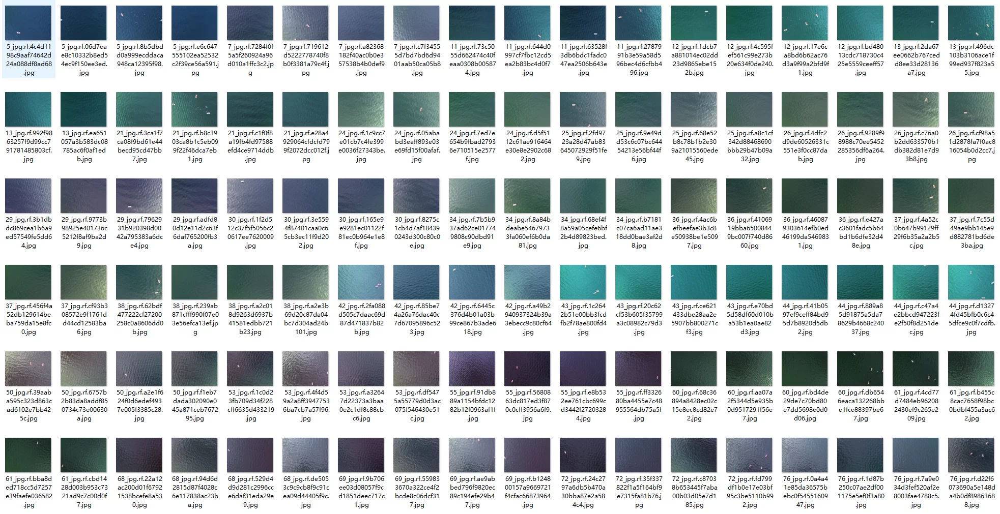
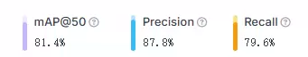
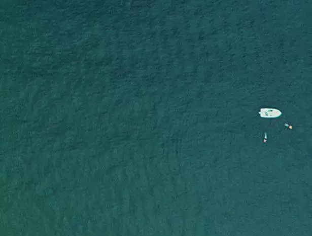
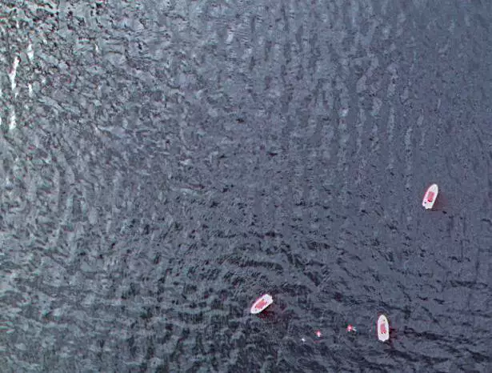

## Body

Drone Maritime Rescue Object Detection Dataset - YOLO format

Totally 35,720 images are available, each labeled in YOLO format. The training set (25,004), test set (3,572), and validation set (7,144) are well-defined.

The dataset is divided into 5 categories: 'boat', 'buoy', 'jetski', 'life_saving_appliances', 'swimmer'.

Electronic virtual products sold without return or exchange.

## Images

item_1057158989525

Here is a pay link on Stripe ( https://buy.stripe.com/3cs8yP7sY87d0vu9AB ). Please contact me lonlonago@foxmail.com after funding $89, and I will send you a complete data files , thank you!

